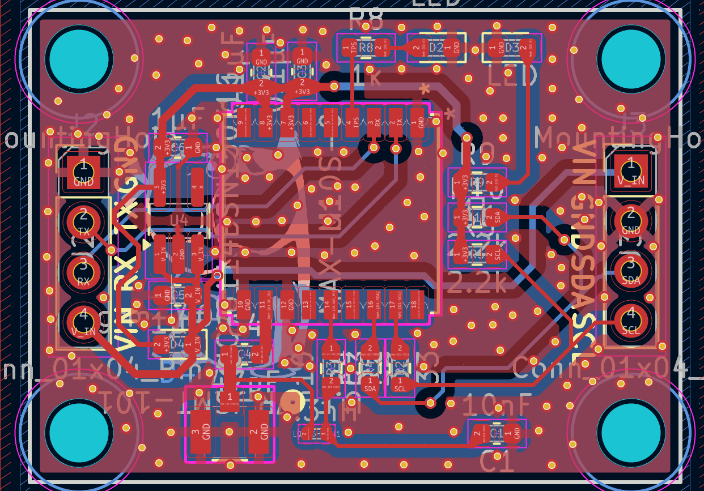
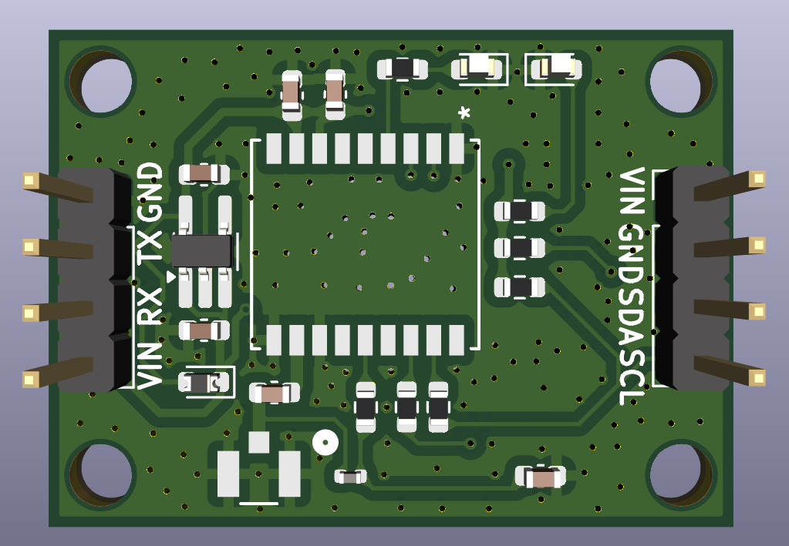

> [!WARNING]

> Kicad v9を用いて作成したため、これ以下のバージョンのkicadだと動きません

## 使用部品

| 部品名 | 個数 | URL |
| --- | --- | --- |
| MAX-M10S | 1 | https://www.digikey.jp/ja/products/detail/u-blox/MAX-M10S-00B/15712906 |
| RT9080 3.3V レギュレーター | 1 | https://akizukidenshi.com/catalog/g/g129588/ |
| 1608 コンデンサ 4.7pF | 1 | - |
| 1608 コンデンサ 10nF | 1 | - |
| 1608 コンデンサ 0.1uF | 2 | https://akizukidenshi.com/catalog/g/g113374/ |
| 1608 コンデンサ 1uF | 2 | - |
| 1608 コンデンサ 10uF | 2 | https://akizukidenshi.com/catalog/g/g113161/ |
| 1608 抵抗 10Ω | 1 | - |
| 1608 抵抗 33Ω | 2 | - |
| 1608 抵抗 1kΩ | 2 | - |
| 1608 抵抗 2.2kΩ | 2 | - |
| フェライトビーズ 4.3nH | 1 | - |
| u.FL コネクタ | 1 | https://akizukidenshi.com/catalog/g/g115417/ |
| 1608 逆流防止ダイオード | 1 | - |

